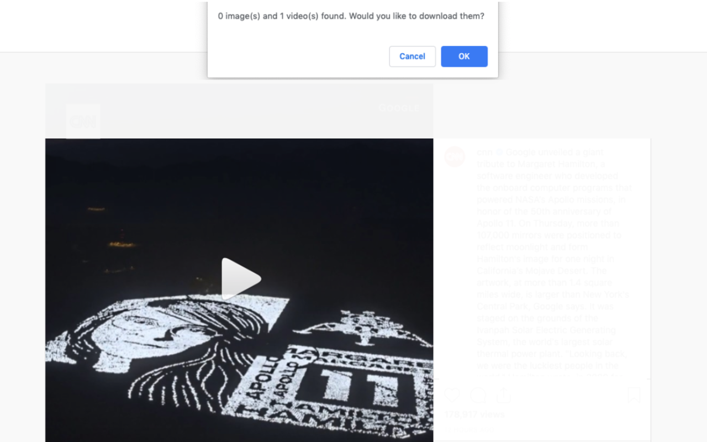
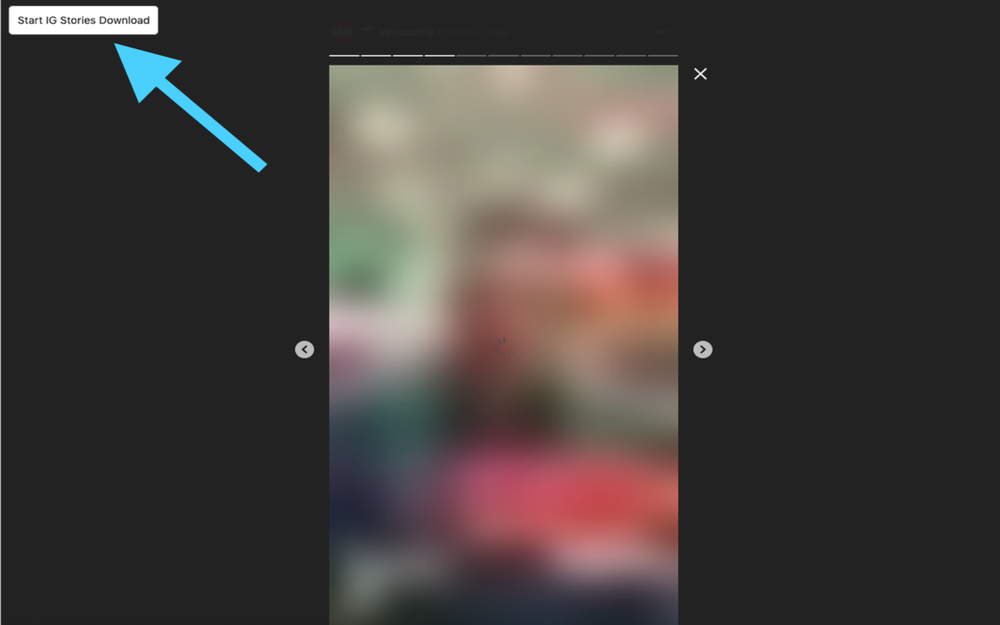

# ig-download-chrome-extension
After installing the extension, navigate to ig's website and log in. From there you have the following options:
## Download regular IG posts images/videos:  
* click on a post on ig to open it. 
* a confirm dialog should pop up asking if you want to download the files. 

## Download IG stories:  
* click on a story to open it in the story viewer. 
* click start download button on top left of page and stories should start downloading as they are played. 
* click stop download button on top left of page to stop downloading. 
 

# Installation

## Manual Download
* clone this repo to a chosen folder 
* open chrome 
* navigate to chrome://extensions 
* click "load unpacked" 
* select the repo! 

## Chrome Store
To add to chrome through chrome store <a href="https://chrome.google.com/webstore/detail/ig-downloader/gelbcoobaindiodaajafdoibjohgnnda">CLICK HERE</a> (free download)